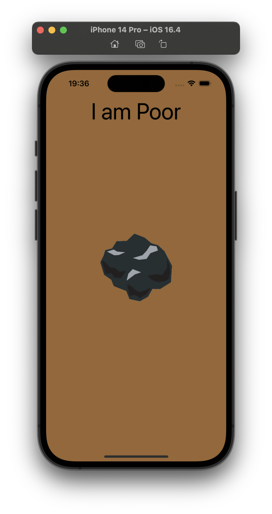

<h1 align="center">I Am Poor</h1>

### Tecnologias Usadas
- Swift
- UIKit
- Viewcode without storyboard
- xcode 14.3.1

### Componentes Utilizados
- Label
- UIImageView
- UIImage

### Conceitos aplicados
- constraints
- icone do app

### Como executar
1. Clone o repo `https://github.com/Luizrebelatto/Projects-viewcode-ios-swift.git`
2. Acesse o projeto `IAmPoor` pelo xcode
3. Execute o emulador

### Screen
     

  

