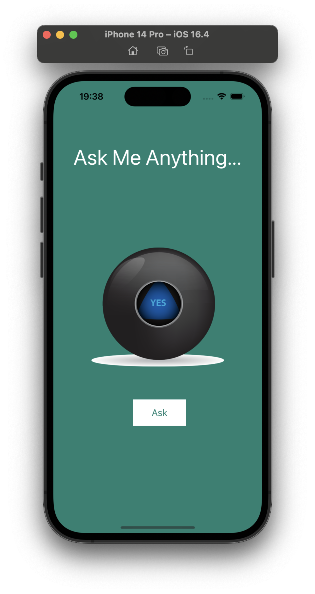

<h1 align="center">Magic 8 Ball</h1>

### Sobre
- Sorteador de frases

### Tecnologias Usadas
- Swift
- UIKit
- xcode 14.3.1

### Componentes Utilizados
- Label
- UIImageView
- UIImage
- UIButton

### Conceitos aplicados
- constraints
- icone do app
- Viewcode sem storyboard
- Conexão de função com botão
- Array
- Int.random -> Função para sortear números aleatórios
- Criação de cores na pasta assets

### Como executar
1. Clone o repo `https://github.com/Luizrebelatto/Projects-viewcode-ios-swift.git`
2. Acesse o projeto `magic-8-ball` pelo xcode
3. Execute o emulador pressionando o atalho `command + B`

### Screen
     

  

